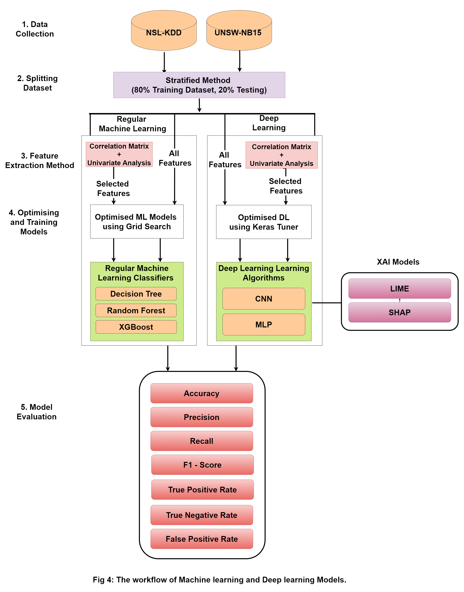
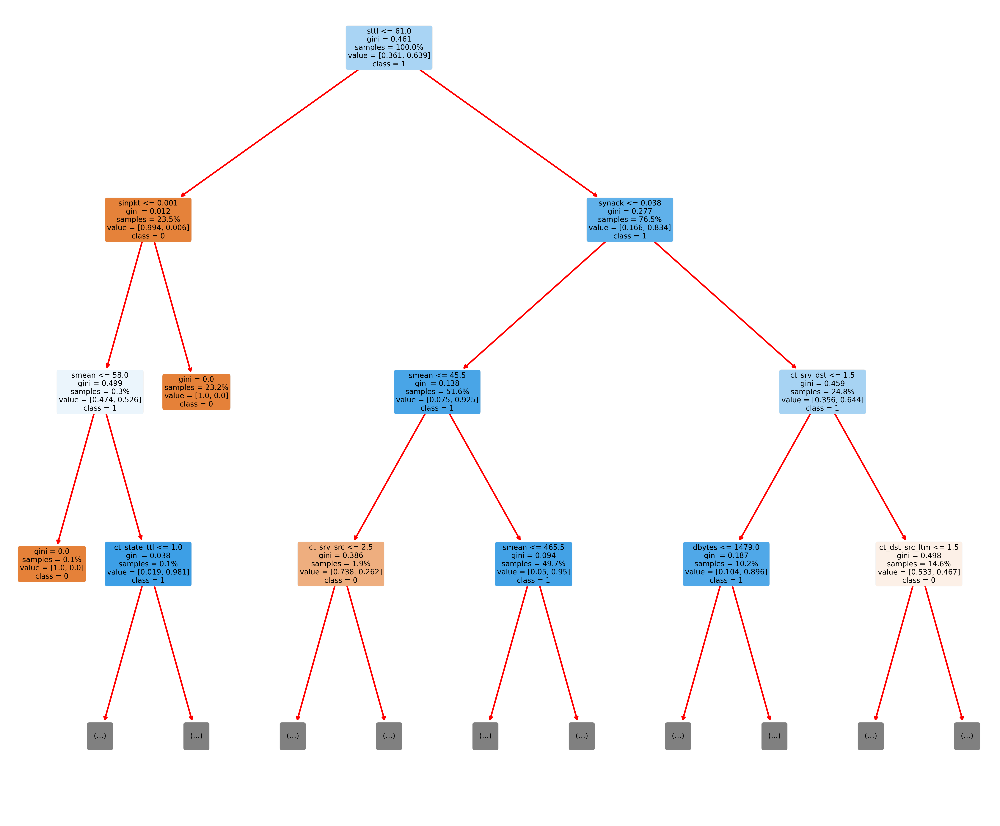
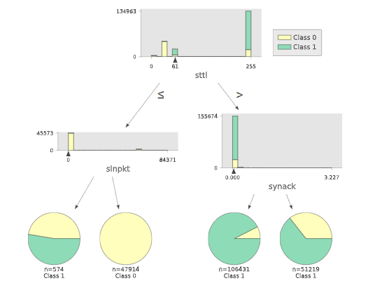
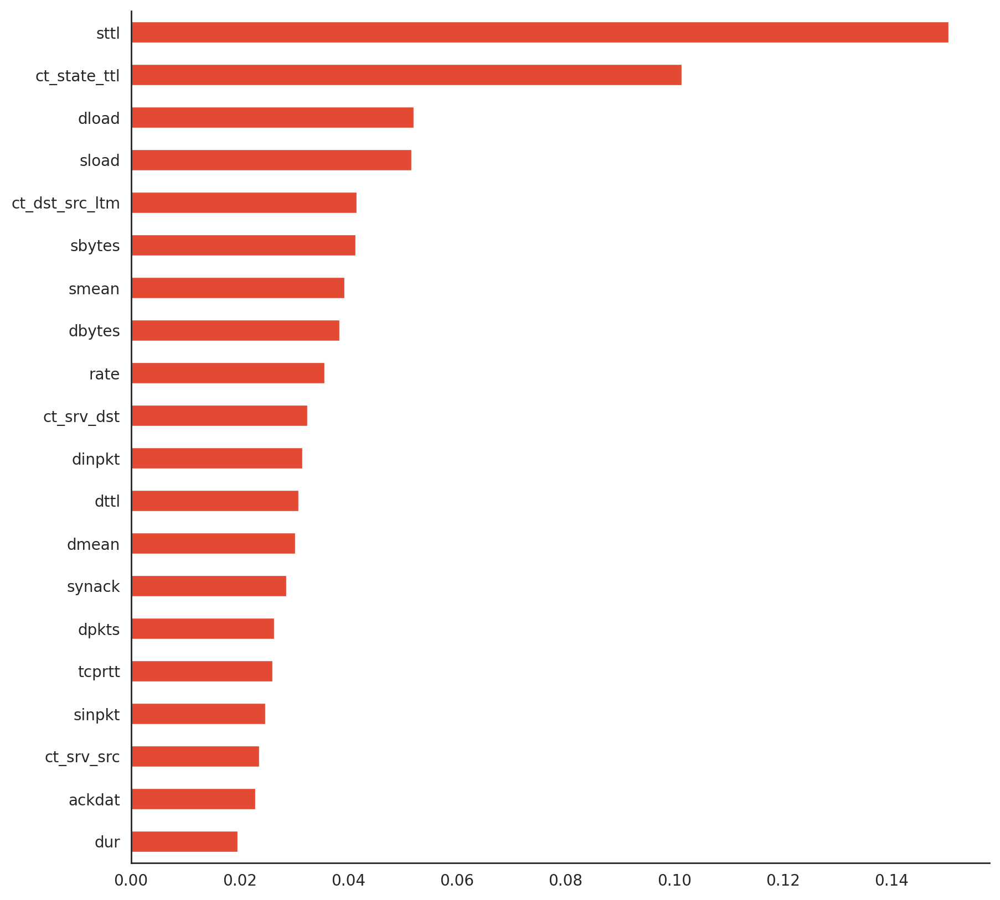
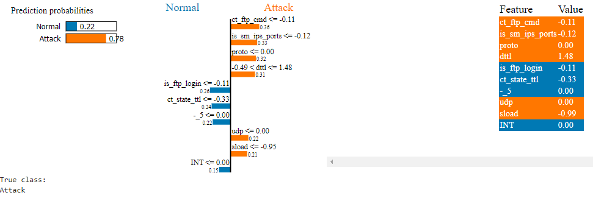
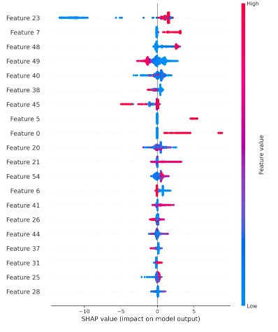

# Enhancing IoT Security with Explainable AI-Powered Intrusion Detection Systems
## Project Overview
The rapid growth of IoT devices has brought a significant increase in security challenges. Our project aims to address these challenges by developing an Intrusion Detection System (IDS) that not only detects threats accurately but also provides transparency in its decision-making processes. We employ both interpretable models like Random Forest (RF), Decision Tree (DT), and XGBoost, as well as black-box models such as Multi-Layer Perceptron (MLP) and Convolutional Neural Networks (CNN), to create a robust IDS. This combination of models allows us to balance high performance with interpretability.

## Key Highlights
- DARPA Framework: Our approach follows the DARPA methodology, covering pre-modeling, modeling, and post-modeling phases.
- Feature Engineering Insights: We observed that feature engineering had a limited impact on model performance, with only minor declines in performance upon removing certain features.
- Model Comparison: White-box models like RF consistently outperformed black-box models in metrics such as accuracy, F1-score, and precision. RF emerged as the best overall performer, offering both high accuracy and interpretability.
- Explainable AI (XAI) Integration: We used XAI techniques to enhance model transparency, making the IDS more suitable for practical applications in IoT security.

## Methodology
Our methodology follows the DARPA framework and includes:

- Premodeling Phase: Data preprocessing and feature selection.
- Modeling Phase: Training both interpretable (RF, DT, XGBoost) and black-box (MLP, CNN) models.
- Post-modeling Phase: Evaluating and interpreting model outputs with Explainable AI techniques such as LIME, and SHAP.

## Dataset
The datasets used for this project include:
- NSL-KDD and UNSW-NB15 Dataset: Used for Model training and evaluation. Available for download [Here](https://drive.google.com/drive/folders/15vnzqj4Ji9naEntCxJQT4d52whGddcTO?usp=sharing).

## Results

### UNSW Dataset
| Metric     | DT | RF | XGB | MLP | CNN |
|------------|---------|---------|---------|---------|---------|
| Accuracy   | 99.42   | 99.55   | 99.62   | 94.48   | 98.38   |
| Recall     | 99.42   | 99.55   | 99.62   | 94.48   | 98.38   |
| Precision  | 99.44   | 99.54   | 99.61   | 94.88   | 98.32   |
| F1-Score   | 99.43   | 99.55   | 99.61   | 94.64   | 98.35   |

### NSL-KDD Dataset
| Metric          | DT | RF | XGB | MLP | CNN |
|-----------------|---------|---------|---------|---------|---------|
| Accuracy| 99.44   | 99.55   | 99.63   | 95.05   | 98.23   |
| Recall          | 99.44   | 99.55   | 99.63   | 95.05   | 98.23   |
| Precision       | 99.44   | 99.54   | 99.62   | 95.10   | 98.31   |
| F1-Score        | 99.44   | 99.54   | 99.62   | 95.06   | 98.24   |

## Explainbality

### Decision Tree
- Explainability: Decision Trees are inherently interpretable due to their simple, rule-based structure. Each node in the tree represents a decision based on a feature threshold, leading to a prediction at the leaves.
- How to Understand: You can visualize the entire tree structure to see the sequence of decisions leading to each outcome. This gives a clear path from input features to the prediction, allowing you to understand precisely which conditions triggered the prediction.

### Random Forest
- Explainability: A Random Forest is an ensemble of Decision Trees, so individual trees remain interpretable. However, the ensemble nature makes the overall model more complex.
- How to Understand: Feature importance scores are commonly used with Random Forests to indicate which features contribute most to predictions. By analyzing the importance scores, you can see the dominant features that influence the model’s decisions, even though the path to each prediction isn’t as clear as in a single Decision Tree.

### Convolutional Neural Network (CNN)
- Explainability: CNNs are black-box models, making it difficult to interpret their internal workings directly because they learn abstract representations of data through layers of transformations. So for that reason, we use SHAP and LIME.

### LIME (Local Interpretable Model-agnostic Explanations)
- Explainability: LIME approximates a complex model with an interpretable model locally around each prediction, making it useful for any black-box model, including CNNs and MLPs.

### SHAP (SHapley Additive exPlanations)
- Explainability: SHAP values provide a game-theoretic approach to explainability, showing the contribution of each feature to the model's prediction across the entire dataset.

### Paper: Coming Soon!
